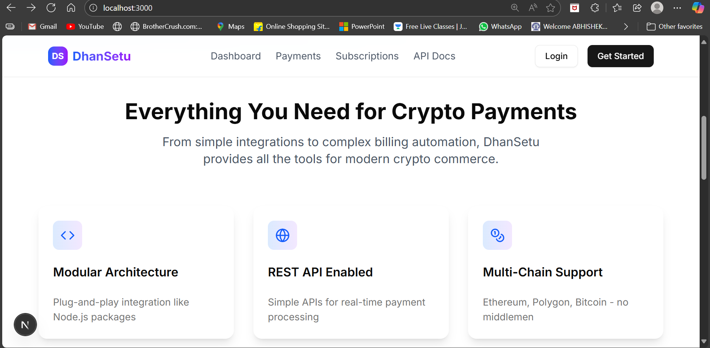

# 🚀 DhanSetu Gateway - Complete Crypto Payment System

<div align="center">
  
</div>

## 🌟 Overview

DhanSetu Gateway is a comprehensive crypto payment gateway system built with Next.js 15, TypeScript, and multi-blockchain support. It provides everything you need for modern crypto commerce, from simple integrations to complex billing automation.

**🎯 Live Demo**: [View Application](http://localhost:3000) (when running locally)

## ✨ Key Features

### 🔗 Multi-Chain Support
- **6 Blockchains**: Ethereum, Polygon, BSC, Arbitrum, Optimism, Solana
- **Token Support**: Native currencies + ERC20/BEP20/SPL tokens
- **Network Switching**: Dynamic provider selection

### 💰 Payment Processing
- **QR Code Generation**: Instant payment links
- **Real-time Monitoring**: Blockchain confirmation tracking
- **Webhook Support**: Automated merchant notifications
- **Invoice System**: Professional payment management

### 🔄 Subscription Engine
- **Recurring Billing**: Automated cron-based processing
- **Plan Management**: Flexible subscription tiers
- **Trial Periods**: Free trial support
- **Analytics**: MRR tracking and metrics

### 🔐 Security & Encryption
- **HD Wallet**: BIP39 mnemonic-based wallet generation
- **Encryption**: AES-256 for sensitive data
- **JWT Authentication**: Secure API access
- **Webhook Verification**: HMAC signature validation

## 🏗️ Architecture

### Backend Services
```
lib/services/
├── blockchain.ts     # Multi-chain blockchain integration
├── payment.ts        # Payment processing service
├── subscription.ts   # Recurring payments service
└── wallet.ts         # HD wallet management
```

### API Endpoints
```
/api/
├── payments/         # Payment management
├── subscriptions/    # Subscription handling
├── wallets/          # Wallet operations
└── chains/           # Blockchain queries
```

### Frontend Pages
```
app/
├── dashboard/        # Analytics dashboard
├── payments/create/  # Payment creation
├── pay/[id]/        # Payment processing
├── subscriptions/    # Subscription management
└── api-docs/        # API documentation
```

## 🚀 Quick Start

### Prerequisites
- Node.js 18+
- Git
- A crypto wallet for testing

### Installation

1. **Clone the repository**
   ```bash
   git clone https://github.com/AnuragTiwari1508/dhan-setu.git
   cd dhan-setu
   ```

2. **Install dependencies**
   ```bash
   npm install --legacy-peer-deps
   ```

3. **Set up environment variables**
   ```bash
   cp .env.example .env.local
   ```
   
   Edit `.env.local` with your configuration:
   ```env
   # Blockchain RPC URLs
   ETHEREUM_RPC_URL=https://mainnet.infura.io/v3/YOUR_KEY
   POLYGON_RPC_URL=https://polygon-mainnet.infura.io/v3/YOUR_KEY
   BSC_RPC_URL=https://bsc-dataseed.binance.org/
   
   # Security
   JWT_SECRET=your-super-secret-jwt-key
   ENCRYPTION_KEY=your-32-character-encryption-key
   WEBHOOK_SECRET=your-webhook-secret-key
   ```

4. **Run the development server**
   ```bash
   npm run dev
   ```

5. **Open your browser**
   Visit [http://localhost:3000](http://localhost:3000)

## 📊 Usage Examples

### Create a Payment
```bash
curl -X POST http://localhost:3000/api/payments \
  -H "Content-Type: application/json" \
  -d '{
    "amount": "0.1",
    "currency": "ETH",
    "network": "ethereum",
    "metadata": {
      "description": "Test payment",
      "customerEmail": "customer@example.com"
    }
  }'
```

### Check Payment Status
```bash
curl http://localhost:3000/api/payments/PAYMENT_ID
```

### Create a Subscription Plan
```bash
curl -X POST http://localhost:3000/api/subscriptions/plans \
  -H "Content-Type: application/json" \
  -d '{
    "name": "Premium Plan",
    "amount": "29.99",
    "currency": "USDC",
    "interval": "monthly"
  }'
```

## 🔧 API Documentation

### Payment Endpoints
- `POST /api/payments` - Create a new payment
- `GET /api/payments` - List all payments
- `GET /api/payments/[id]` - Get payment details
- `PATCH /api/payments/[id]` - Update payment
- `GET /api/payments/stats` - Payment statistics

### Subscription Endpoints
- `POST /api/subscriptions` - Create subscription
- `GET /api/subscriptions` - List subscriptions
- `GET /api/subscriptions/[id]` - Get subscription details
- `PATCH /api/subscriptions/[id]` - Update subscription
- `POST /api/subscriptions/plans` - Create plan
- `GET /api/subscriptions/plans` - List plans
- `GET /api/subscriptions/stats` - Subscription statistics

### Wallet Endpoints
- `POST /api/wallets` - Create new wallet
- `GET /api/wallets/[id]` - Get wallet details
- `POST /api/wallets/[id]/sign` - Sign transaction
- `GET /api/wallets/[id]/balance` - Get wallet balance

### Blockchain Endpoints
- `GET /api/chains` - List supported blockchains
- `GET /api/chains/[network]` - Get network information
- `POST /api/chains/[network]/tx` - Send transaction

## 🛠️ Technology Stack

### Frontend
- **Next.js 15.2.4** - React framework
- **React 19** - UI library
- **TypeScript** - Type safety
- **Tailwind CSS** - Styling
- **shadcn/ui** - UI components

### Backend
- **Node.js** - Runtime
- **Ethers.js** - Ethereum interaction
- **Solana Web3.js** - Solana interaction
- **BIP39** - Mnemonic generation
- **bcryptjs** - Encryption
- **JWT** - Authentication

### Blockchain Support
- **Ethereum** - ETH and ERC20 tokens
- **Polygon** - MATIC and tokens
- **BSC** - BNB and BEP20 tokens
- **Arbitrum** - Layer 2 scaling
- **Optimism** - Layer 2 scaling
- **Solana** - SOL and SPL tokens

## 🌍 Multi-Chain Configuration

The system supports multiple blockchain networks out of the box:

```typescript
const SUPPORTED_NETWORKS = {
  ethereum: {
    name: 'Ethereum',
    chainId: 1,
    currency: 'ETH',
    rpcUrl: process.env.ETHEREUM_RPC_URL
  },
  polygon: {
    name: 'Polygon',
    chainId: 137,
    currency: 'MATIC',
    rpcUrl: process.env.POLYGON_RPC_URL
  },
  bsc: {
    name: 'Binance Smart Chain',
    chainId: 56,
    currency: 'BNB',
    rpcUrl: process.env.BSC_RPC_URL
  },
  // ... more networks
}
```

## 🔒 Security Features

- **HD Wallet Generation**: BIP39 mnemonic-based wallet creation
- **Encrypted Storage**: AES-256 encryption for sensitive data
- **JWT Authentication**: Secure API access control
- **Webhook Verification**: HMAC signature validation
- **Input Validation**: Comprehensive request validation
- **Rate Limiting**: API endpoint protection

## 📈 Analytics & Monitoring

### Dashboard Features
- Real-time payment statistics
- Transaction monitoring
- Revenue analytics
- Subscription metrics
- Network health status

### Webhook Notifications
```typescript
// Example webhook payload
{
  "event": "payment.confirmed",
  "data": {
    "id": "pay_123",
    "amount": "0.1",
    "currency": "ETH",
    "status": "confirmed",
    "transactionHash": "0x...",
    "timestamp": "2025-08-10T20:03:15Z"
  }
}
```

## 🧪 Testing

### Manual Testing
1. Visit the dashboard at `/dashboard`
2. Create a payment at `/payments/create`
3. Process payment at `/pay/[id]`
4. Manage subscriptions at `/subscriptions`

### API Testing
Use the provided curl commands or tools like Postman to test the API endpoints.

## 🚀 Deployment

### Environment Setup
1. Set up production environment variables
2. Configure blockchain RPC endpoints
3. Set up webhook URLs
4. Configure email notifications

### Deployment Options
- **Vercel**: Easy deployment with built-in optimizations
- **Docker**: Containerized deployment
- **Traditional hosting**: VPS or dedicated servers

## 🤝 Contributing

1. Fork the repository
2. Create your feature branch (`git checkout -b feature/amazing-feature`)
3. Commit your changes (`git commit -m 'Add some amazing feature'`)
4. Push to the branch (`git push origin feature/amazing-feature`)
5. Open a Pull Request

## 📝 License

This project is licensed under the MIT License - see the [LICENSE](LICENSE) file for details.

## 🙏 Acknowledgments

This project integrates concepts and code from several open-source projects:
- **BitCart** - Payment processing architecture
- **Polygon P2P Payment** - Multi-chain concepts
- **Crypto-Payment-API** - API design patterns
- **CoindPay** - Gateway architecture
- **Spheron Subscriptions** - Smart contract subscriptions
- **BitDiem Recur** - Recurring payment processing
- **ethereum-hdwallet** - HD wallet implementation
- **Hummingbot Gateway** - Blockchain provider management

## 📞 Support

For support, email anuragtiwari1508@gmail.com or open an issue in the GitHub repository.

## 🔮 Roadmap

- [ ] Advanced analytics dashboard
- [ ] Mobile app support
- [ ] More blockchain integrations
- [ ] Advanced smart contract features
- [ ] Merchant tools and APIs
- [ ] Multi-language support

---

<div align="center">
  <strong>Built with ❤️ by Anurag Tiwari</strong><br>
  <a href="https://github.com/AnuragTiwari1508">GitHub</a> •
  <a href="mailto:anuragtiwari1508@gmail.com">Email</a>
</div>
